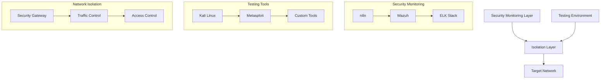
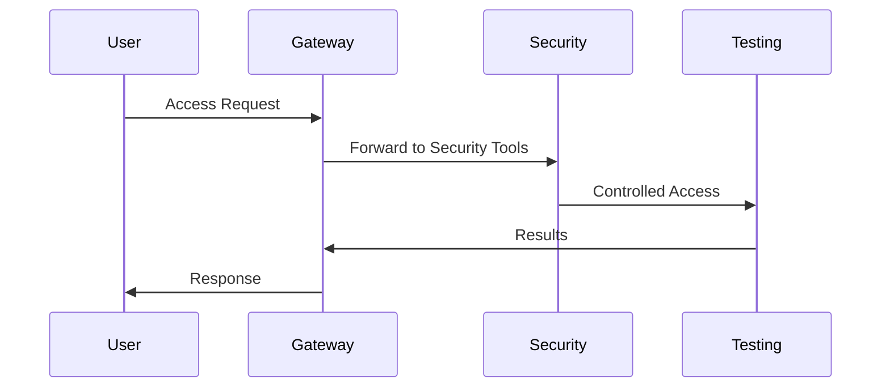

# Architecture Documentation

## System Overview

The Automated Security Testing Lab (ASTL) is designed as a modular, containerized security testing environment with three distinct layers:

## Component Details

### 1. Security Monitoring Layer

#### n8n Automation Server
- **Purpose**: Workflow automation and orchestration
- **Configuration**: 
  - Port: 5678
  - Authentication: Basic Auth
  - Volume: n8n_data
- **Dependencies**: None
- **Resource Usage**: 
  - Memory: 512MB
  - CPU: 1 core

#### Wazuh Manager
- **Purpose**: Host-based intrusion detection
- **Configuration**:
  - Ports: 1514, 1515, 55000
  - Volume: wazuh_data
- **Dependencies**: None
- **Resource Usage**:
  - Memory: 2GB
  - CPU: 2 cores

#### ELK Stack
- **Purpose**: Log aggregation and analysis
- **Components**:
  - Elasticsearch
  - Kibana
- **Configuration**:
  - Elasticsearch Port: 9200
  - Kibana Port: 5601
  - Volume: elasticsearch_data
- **Resource Usage**:
  - Memory: 2GB (optimized)
  - CPU: 2 cores

### 2. Testing Environment

#### Kali Linux Container
- **Purpose**: Penetration testing platform
- **Configuration**:
  - Network: attack_net
  - Volume: kali_shared
- **Tools Included**:
  - Nmap
  - Metasploit
  - Custom scripts

#### Metasploit Framework
- **Purpose**: Exploitation framework
- **Configuration**:
  - Network: attack_net
- **Integration**:
  - Automated scanning
  - Vulnerability validation

### 3. Isolation Layer

#### Security Gateway
- **Purpose**: Network isolation and access control
- **Configuration**:
  - Port: 8080
  - Networks: security_net, attack_net
- **Features**:
  - Traffic filtering
  - Access control
  - Logging

## Network Architecture

### Network Segments

1. **security_net**
   - Type: bridge
   - Internal: true
   - Purpose: Security monitoring tools

2. **attack_net**
   - Type: bridge
   - Internal: false
   - Purpose: Testing tools

### Network Flow

## Data Flow

### Security Events

1. **Collection**
   - Wazuh agents collect events
   - Network sensors gather traffic data
   - System logs are aggregated

2. **Processing**
   - Elasticsearch indexes events
   - n8n workflows process alerts
   - Automated response triggers

3. **Analysis**
   - Kibana dashboards
   - Custom reports
   - Threat correlation

### Testing Data

1. **Scan Results**
   - Vulnerability scans
   - Compliance checks
   - Network discovery

2. **Attack Data**
   - Penetration test results
   - Exploitation attempts
   - Security validations

## Scaling Considerations

### Current Limitations
- 50 device maximum
- 2GB Elasticsearch heap
- Single Wazuh manager

### Scaling Options
- Increase Elasticsearch resources
- Add Wazuh workers
- Distribute network load

## Security Controls

### Access Control
- Basic authentication
- Network isolation
- Role-based access

### Monitoring
- System metrics
- Network traffic
- Security events

### Compliance
- Automated audits
- Configuration checks
- Report generation

## Disaster Recovery

### Backup Strategy
- Volume backups
- Configuration backups
- Data exports

### Recovery Procedures
1. Stop services
2. Restore volumes
3. Verify configurations
4. Restart services

## Maintenance

### Regular Tasks
- Log rotation
- Database cleanup
- Rule updates

### Updates
- Container updates
- Security patches
- Tool upgrades
