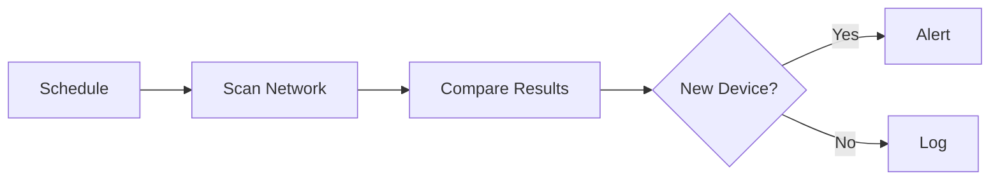
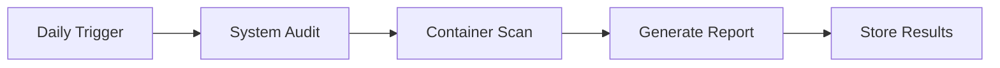
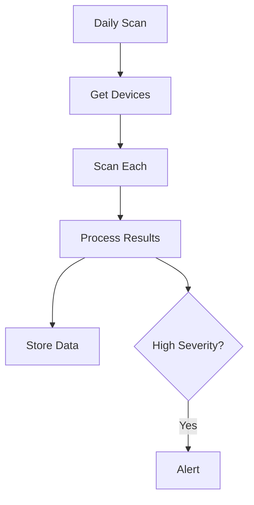
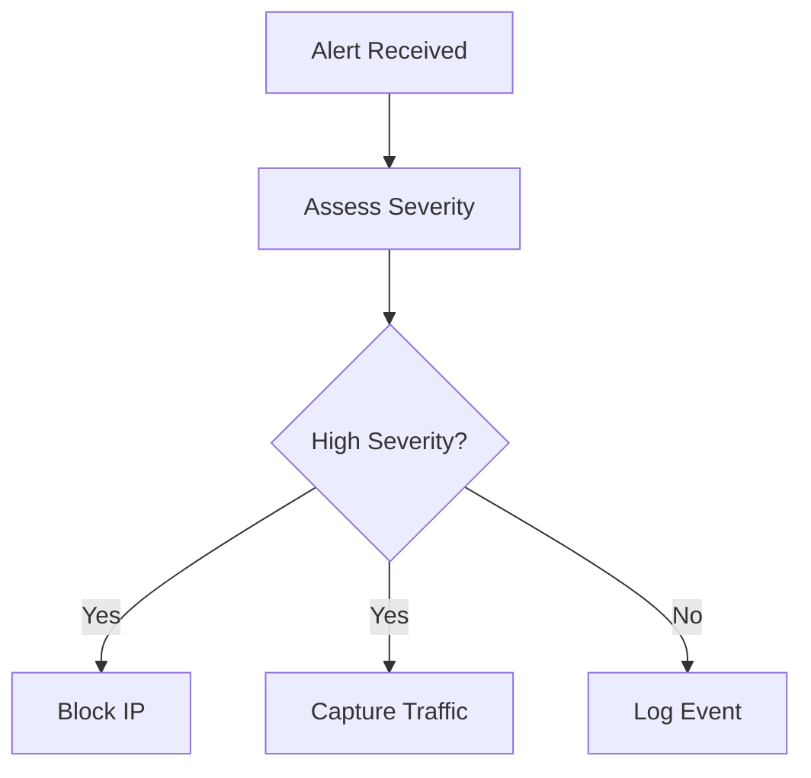
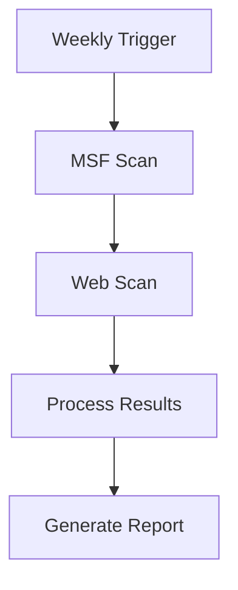
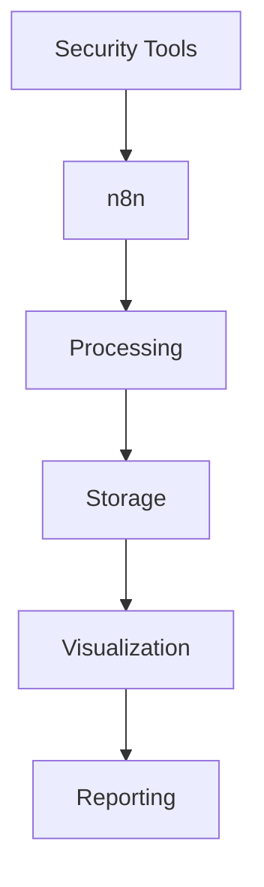

# Security Workflows Documentation

## Overview

This document details the automated security workflows implemented in the Automated Security Testing Lab (ASTL). Each workflow is categorized by complexity level and includes detailed configuration information.

## Workflow Categories

### Level 1 - Basic Security

These workflows are designed for basic security monitoring and compliance, suitable for initial setup and baseline security.

#### 1. Network Discovery


**Configuration:**
```json
{
  "schedule": "*/6 * * * *",
  "scan_range": "192.168.1.0/24",
  "alert_threshold": 1
}
```

#### 2. Compliance Audit


### Level 2 - Advanced Monitoring

These workflows provide enhanced security monitoring and automated response capabilities.

#### 3. Vulnerability Assessment


**Scan Configuration:**
```yaml
nmap_options:
  - -sV  # Version detection
  - -sC  # Script scan
  - --script vuln  # Vulnerability scripts
```

#### 4. Incident Response


### Level 3 - Security Testing

Advanced workflows for security testing and threat hunting.

#### 5. Automated Pentest


**Testing Scope:**
```yaml
scope:
  ports: "1-65535"
  services:
    - http
    - https
    - ssh
  exclusions:
    - 10.0.0.1/24
```

#### 6. Threat Hunting


## Workflow Details

### 1. Network Discovery

**Purpose:** Continuously monitor network for new devices and changes.

**Components:**
- Nmap for network scanning
- Device inventory database
- Alert system

**Implementation:**
```javascript
// Example n8n code
const scan = await $node.executeCommand('nmap -sn 192.168.1.0/24');
const devices = parseNmapOutput(scan.stdout);
const newDevices = compareWithInventory(devices);

if (newDevices.length > 0) {
  await sendAlert({
    type: 'new_device',
    devices: newDevices
  });
}
```

### 2. Vulnerability Assessment

**Purpose:** Identify and track system vulnerabilities.

**Features:**
- Version detection
- Vulnerability scanning
- Risk assessment
- Reporting

**Configuration:**
```yaml
scan_config:
  frequency: daily
  parallel_scans: 5
  timeout: 1800
  retry_count: 3
```

### 3. Threat Hunting

**Purpose:** Proactive threat detection and response.

**Data Sources:**
- Network traffic
- System logs
- Threat intelligence
- OSINT feeds

**Integration:**
```javascript
// Example threat intel processing
async function processIntel(data) {
  const iocs = extractIOCs(data);
  const rules = generateRules(iocs);
  await updateDetectionSystem(rules);
}
```

## Workflow Management

### Scheduling

```yaml
schedules:
  network_discovery:
    cron: "0 */6 * * *"
    timezone: "UTC"
  
  vulnerability_scan:
    cron: "0 0 * * *"
    timezone: "UTC"
  
  threat_hunt:
    cron: "0 */4 * * *"
    timezone: "UTC"
```

### Resource Management

```yaml
resource_limits:
  parallel_workflows: 3
  max_memory_per_workflow: "1GB"
  timeout: 3600
```

### Error Handling

```javascript
try {
  // Workflow execution
} catch (error) {
  await handleError({
    workflow: workflow_name,
    error: error,
    severity: 'high',
    notification: true
  });
}
```

## Integration Points

### External Systems

```yaml
integrations:
  slack:
    webhook: "https://hooks.slack.com/..."
    channel: "#security-alerts"
  
  elasticsearch:
    host: "localhost:9200"
    index: "security-events"
  
  wazuh:
    api_url: "https://localhost:55000"
    api_user: "wazuh-wui"
```

### Data Flow



## Best Practices

### Workflow Development

1. **Testing**
   - Test in isolated environment
   - Validate all inputs
   - Check error handling

2. **Documentation**
   - Comment complex logic
   - Update workflow documentation
   - Maintain version history

3. **Security**
   - Use secure credentials
   - Validate external data
   - Monitor resource usage

### Maintenance

1. **Regular Tasks**
   - Update threat intelligence
   - Tune detection rules
   - Optimize performance

2. **Monitoring**
   - Check workflow execution
   - Monitor resource usage
   - Track success rates

## Troubleshooting

### Common Issues

1. **Workflow Failures**
   - Check connectivity
   - Verify credentials
   - Review logs

2. **Performance Issues**
   - Monitor resource usage
   - Check scheduling conflicts
   - Optimize queries

### Debug Process

```yaml
debug_steps:
  1: Check workflow logs
  2: Verify external connectivity
  3: Validate data formats
  4: Test individual nodes
  5: Review resource usage
```
