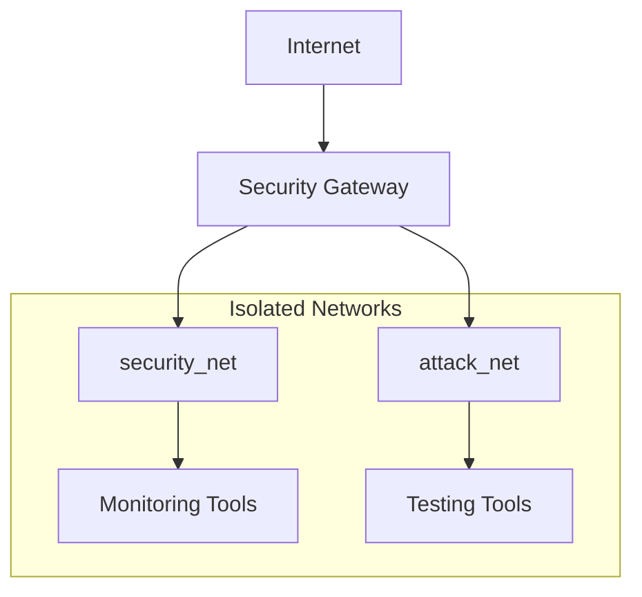

# Security Documentation

## Overview

This document outlines the security considerations, configurations, and best practices for the Automated Security Testing Lab (ASTL).

## Security Measures

### Access Control

#### Authentication
- n8n Dashboard: Basic Auth
- Kibana: Basic Auth
- Wazuh Manager: API authentication

#### Default Credentials (CHANGE THESE)
```yaml
n8n:
  username: admin
  password: changeme

kibana:
  username: elastic
  password: changeme

wazuh:
  username: wazuh
  password: changeme
```

### Network Security

#### Network Isolation


#### Firewall Rules
```bash
# Example iptables rules
iptables -A INPUT -p tcp --dport 5678 -j ACCEPT  # n8n
iptables -A INPUT -p tcp --dport 5601 -j ACCEPT  # Kibana
iptables -A INPUT -p tcp --dport 9200 -j DROP    # Elasticsearch (internal only)
```

### Container Security

#### Resource Limits
```yaml
services:
  elasticsearch:
    deploy:
      resources:
        limits:
          memory: 2G
        reservations:
          memory: 1G
```

#### Security Options
```yaml
security_opts:
  - no-new-privileges:true
  - seccomp:unconfined
```

### Data Security

#### Volume Management
- Persistent volumes for sensitive data
- Regular backups
- Encryption at rest

#### Data Classification
1. High Sensitivity
   - Credentials
   - Test results
   - Network maps

2. Medium Sensitivity
   - System logs
   - Performance metrics
   - Configuration files

3. Low Sensitivity
   - Public documentation
   - Tool descriptions
   - Generic workflows

## Compliance

### Standards Alignment
- CIS Docker Benchmark
- OWASP Security Verification
- NIST Cybersecurity Framework

### Audit Procedures
1. Daily automated checks
2. Weekly manual review
3. Monthly compliance report

## Incident Response

### Security Events

#### Level 1 - Low Severity
- Failed login attempts
- Resource warnings
- Non-critical updates

**Response:**
```yaml
actions:
  - Log event
  - Monitor frequency
  - Update metrics
```

#### Level 2 - Medium Severity
- Multiple failed logins
- Unusual traffic patterns
- System warnings

**Response:**
```yaml
actions:
  - Alert security team
  - Increase monitoring
  - Document incident
```

#### Level 3 - High Severity
- Unauthorized access
- Data breach
- System compromise

**Response:**
```yaml
actions:
  - Immediate isolation
  - Full investigation
  - Stakeholder notification
```

### Recovery Procedures

1. **Immediate Actions**
```bash
# Stop affected services
docker-compose stop affected_service

# Isolate network
iptables -I INPUT -s affected_ip -j DROP

# Preserve evidence
docker cp container_name:/logs /evidence
```

2. **Investigation**
```bash
# Collect logs
docker logs --since 24h affected_service > investigation.log

# Check configuration
docker inspect affected_service > config.json

# Network analysis
tcpdump -i docker0 -w network.pcap
```

3. **Recovery**
```bash
# Restore from backup
docker volume rm affected_volume
docker volume create affected_volume
docker run --rm -v backup:/backup -v affected_volume:/restore busybox cp -a /backup/. /restore/

# Verify integrity
sha256sum /verify/*
```

## Security Hardening

### System Hardening

#### Docker Daemon
```json
{
  "userns-remap": "default",
  "no-new-privileges": true,
  "seccomp-profile": "/etc/docker/seccomp.json",
  "selinux-enabled": true
}
```

#### Container Hardening
```dockerfile
# Example secure Dockerfile
FROM alpine:latest
RUN adduser -D -u 1000 appuser
USER appuser
WORKDIR /app
COPY --chown=appuser:appuser . .
```

### Monitoring

#### Metrics Collection
- Container resource usage
- Network traffic patterns
- Security events

#### Alerting
```yaml
alerts:
  high_cpu:
    threshold: 80%
    duration: 5m
    action: notify

  failed_login:
    threshold: 5
    window: 1h
    action: block_ip
```

## Regular Security Tasks

### Daily
- Review security logs
- Check system resources
- Verify service status

### Weekly
- Update security rules
- Backup critical data
- Review access logs

### Monthly
- Full security audit
- Compliance check
- Update documentation

## Security Contacts

### Emergency Contacts
```yaml
security_team:
  email: security@yourdomain.com
  phone: +1-XXX-XXX-XXXX
  
incident_response:
  email: ir@yourdomain.com
  phone: +1-XXX-XXX-XXXX
```

### Reporting Security Issues
1. Email security@yourdomain.com
2. Include detailed description
3. Attach relevant logs
4. Follow up within 24 hours
